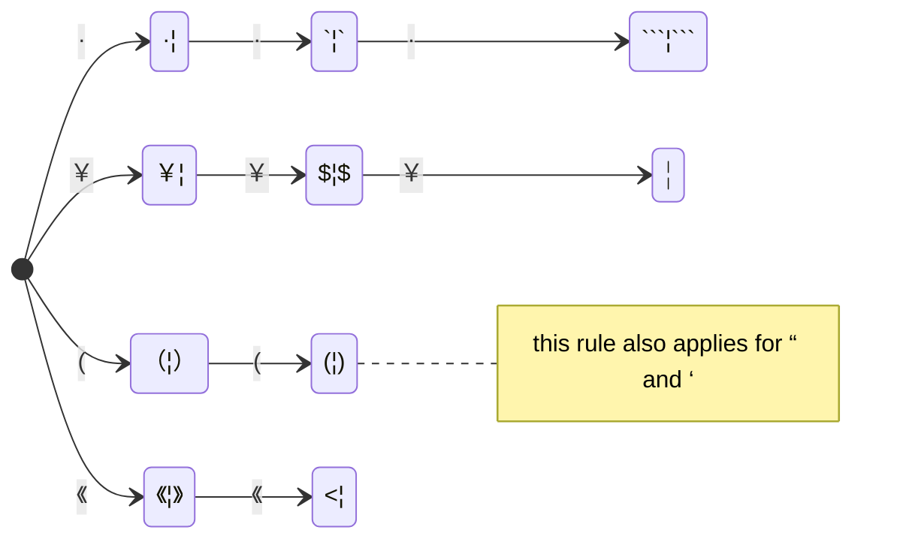

## Obsidian Sample Plugin

Inspired by [Easy Typing](https://github.com/Yaozhuwa/easy-typing-obsidian)

```mermaid
stateDiagram-v2
direction LR
[*] --> ·¦ : ·
·¦ --> `¦` : ·
`¦` --> ```¦``` : ·

[*] --> ￥¦ : ￥
￥¦ --> $¦$ : ￥
$¦$ --> $$¦$$ : ￥

[*] --> （¦）: (
（¦）--> (¦): (
note right of (¦): this rule also applies for “ and ‘ 


[*] --> 《¦》:《
《¦》 --> <¦:《
```
